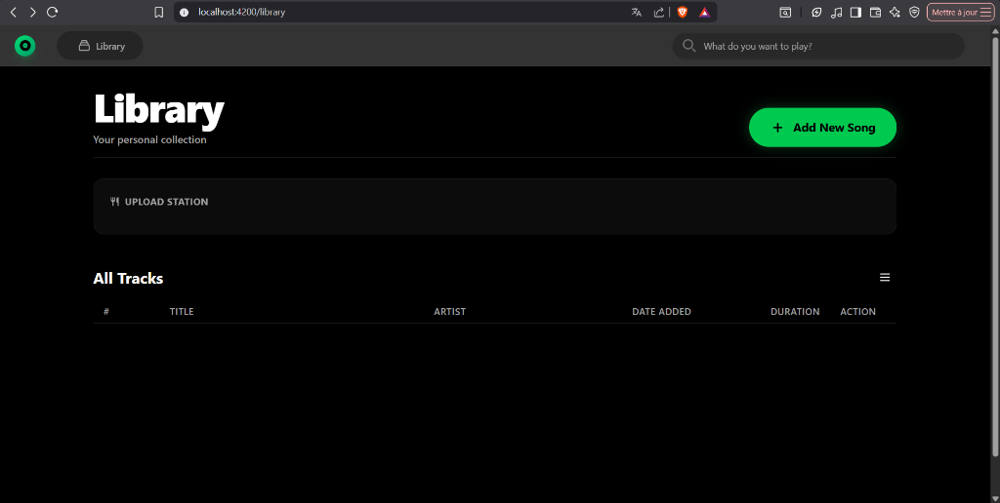
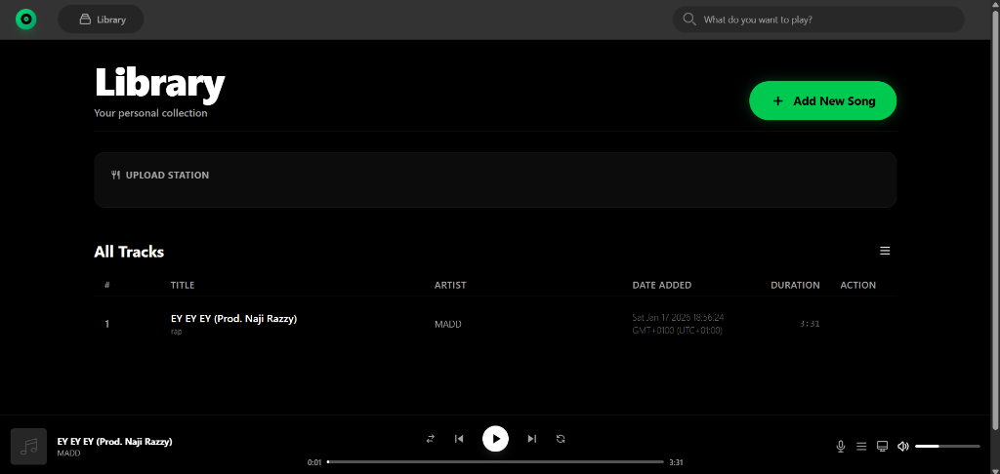
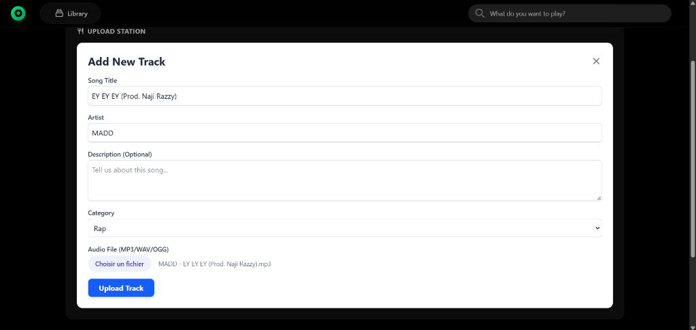

# 🎵 MusicStream - Application de Gestion et Lecture de Musique Locale

**MusicStream** est une application web moderne développée avec **Angular 18**, conçue pour offrir une expérience fluide de gestion et d'écoute de fichiers audio locaux. Ce projet met en œuvre les dernières avancées d'Angular, notamment les **Signals**, pour une gestion d'état réactive et une architecture maintenable.

---

## 📸 Aperçu de l'interface

> **Note :** Insérez vos captures d'écran ci-dessous pour illustrer l'interface utilisateur.

| Vue Bibliothèque | Lecteur Audio | Formulaire d'Ajout |
| :---: | :---: | :---: |
|  |  |  |
| *Espace pour screenshot 1* | *Espace pour screenshot 2* | *Espace pour screenshot 3* |

---

## ✨ Fonctionnalités Principales

### 📂 Gestion des Tracks (CRUD complet)
- **Création** : Formulaire réactif pour ajouter un titre, un artiste et une catégorie.
- **Lecture** : Liste dynamique des morceaux avec recherche textuelle.
- **Mise à jour** : Modification des métadonnées des morceaux existants.
- **Suppression** : Retrait sécurisé des morceaux de la bibliothèque.
- **Métadonnées automatiques** : Calcul automatique de la durée et enregistrement de la date d'ajout.

### 🎧 Lecteur Audio Réactif
- **Contrôles** : Play, Pause, Suivant, Précédent.
- **Navigation** : Barre de progression cliquable et contrôle du volume.
- **États du lecteur** : Gestion précise des états (`playing`, `paused`, `buffering`, `stopped`).

### 💾 Persistance et Stockage
- **IndexedDB** : Utilisation d'une base de données côté client pour stocker les fichiers audio volumineux (jusqu'à 10 Mo) et leurs métadonnées.
- **Formats supportés** : MP3, WAV, OGG.

---

## 🛠️ Stack Technique

- **Framework** : Angular 18 (Standalone Components)
- **Gestion d'état** : Angular Signals & RxJS (BehaviorSubject)
- **Style** : Tailwind CSS (Design moderne inspiré de Spotify)
- **Formulaires** : Reactive Forms avec validations personnalisées
- **Routing** : Configuration avec Lazy Loading pour optimiser les performances

---

## 🏗️ Architecture du Projet

L'application est structurée autour de services spécialisés pour assurer une séparation claire des responsabilités :

- **`AudioPlayerService`** : Cœur de la logique de lecture audio.
- **`TrackService`** : Gère les opérations métier et la communication entre l'UI et le stockage.
- **`StorageService`** : Interface uniforme pour la persistance des données dans IndexedDB.

---

## 🚀 Installation Locale

### Prérequis
- Node.js (v18+)
- Angular CLI installed (`npm install -g @angular/cli`)

### Étapes
1. **Cloner le projet**
   ```bash
   git clone [https://github.com/votre-username/musicstream.git](https://github.com/votre-username/musicstream.git)
   cd musicstream
   Installer les dépendances

Bash

npm install
Lancer le serveur de développement

Bash

ng serve
Accédez à l'application via http://localhost:4200/.

🛡️ Validations et Contraintes
Limites de caractères : Titre (50 max), Description (200 max).

Fichiers : Vérification stricte du format (Audio/Image) et de la taille (10MB max).

Gestion d'erreurs : Messages UI explicites en cas d'échec d'upload ou de lecture.

👤 Auteur
Mohamed el asri

Projet réalisé dans le cadre du cursus Angular (Janvier 2026).
